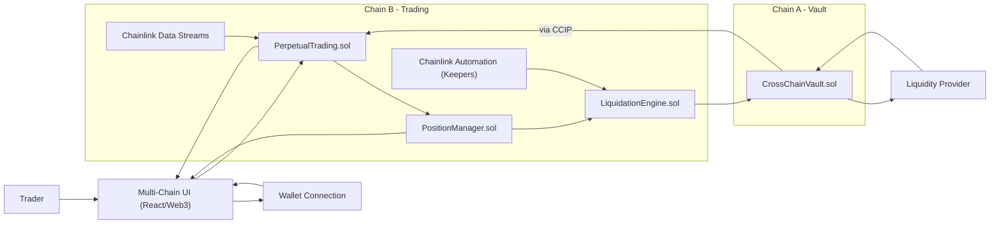

# PerpChain: Cross-Chain Perpetual Trading Platform

## Overview

PerpChain is a decentralized, cross-chain perpetual trading platform that enables users to trade perpetual contracts across multiple blockchains. It solves liquidity fragmentation in DeFi by leveraging Chainlink's CCIP, Data Streams, and Automation. The platform is designed for high performance, security, and seamless user experience, allowing traders to access liquidity and trading opportunities beyond a single blockchain ecosystem.

## Key Features

- **Cross-Chain Trading:** Trade perpetual contracts across multiple blockchain networks.
- **Unified Liquidity:** Aggregates liquidity from different chains for efficient trading.
- **Decentralized Architecture:** All trades and settlements are handled by smart contracts.
- **Real-Time Oracles:** Uses Chainlink Data Streams for accurate, up-to-date pricing.
- **Automated Risk Management:** Chainlink Automation (Keepers) for liquidations and system health.
- **User-Friendly Interface:** Multi-chain frontend for seamless trading and portfolio management.

## How It Works

1. Users connect their wallet and deposit collateral on any supported chain.
2. Collateral is managed by a cross-chain vault system using Chainlink CCIP.
3. Users open long/short perpetual positions, which are managed by the trading engine.
4. Real-time prices are fetched from Chainlink Data Streams.
5. The system continuously monitors positions; risky positions are liquidated automatically.
6. Users can close positions and withdraw funds across chains.

## Architecture

The platform consists of the following components:
- **Multi-Chain UI:** React-based frontend for trading and portfolio management.
- **Backend API:** Node.js/Express backend for business logic and integration.
- **Cross-Chain Vault System:** Solidity contracts for asset management across chains.
- **Perpetual Trading Engine:** Solidity contracts for order matching, margin, and leverage.
- **CCIP Messaging Router:** Chainlink CCIP for cross-chain messaging and asset transfer.
- **Oracles:** Chainlink Data Streams for real-time price feeds.
- **Automation:** Chainlink Keepers for automated liquidations and system tasks.

### Visual Architecture (Mermaid)

### Flow Diagram
- [External Flow Diagram (Eraser)](https://app.eraser.io/workspace/UEKwgkPRaL8QMgGhBDXp)
- See also: `docs/flow_diagram.txt`

## Documentation

- [Complete Build Guide](docs/Complete_Build_Guide.txt)
- [Key Concepts Explanation](docs/Key_Concepts_Explanation.txt)
- [Flow Diagram](docs/flow_diagram.txt)
- [High-Level Architecture](docs/high_level_architec.txt)

---

For more details, see the documentation in the `docs` folder.