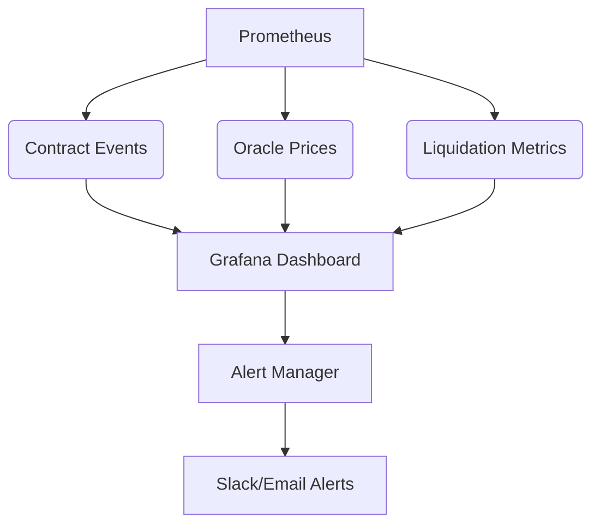

Execution Flow: Real-Life Example
Scenario: Alice deposits $10,000 USDC, opens a 10x long BTC position, and gets liquidated when BTC drops 15%.

Step-by-Step Flow
Deposit Collateral:

Contract: CrossChainVault

Function: depositCollateral(USDC, 10_000)

Action: Alice’s USDC is stored in the vault.

Open Position:

Contract: PerpetualTrading

Function: openPosition("BTC/USD", LONG, 100_000, 10, USDC)

Borrows $90,000 from CrossChainLendingPool.

Records entry price: $50,000/BTC.

Price Update:

Contract: DataStreamOracle

Function: updatePrice("BTC/USD", 42_500)

Triggers TWAP update and circuit breaker checks.

Liquidation:

Contract: LiquidationEngine (via Chainlink Automation)

Function: performUpkeep()

Detects health ratio < 80% (using calculateHealthFactor).

Calls PerpetualTrading.liquidatePosition(positionId).

Repay Debt:

Contract: PerpetualTrading

Function: liquidatePosition(positionId)

Repays $90,000 + interest to CrossChainLendingPool.

Charges 5% penalty to Alice’s collateral.


## Comprehensive Deployment Guide for Cross-Chain Perpetual Trading Platform

### 1. Deployment Sequence
**Deploy contracts in this order to ensure dependencies are resolved:**

1. **DataStreamOracle**
   - Deploy first as it's foundational for price feeds
   - Initialize core feeds: `addFeed("BTC/USD", feedId, 8, 300, 500, fallbackAddress)`
   - Configure circuit breakers and staleness thresholds

2. **PositionManager**
   - Deploy with Oracle address in constructor
   - Set asset/feed mappings: `setAssetFeed(ETH_ADDRESS, ethFeedId)`

3. **CrossChainVault**
   - Deploy with CCIP Router address
   - Add supported tokens: `addSupportedToken(USDC_ADDRESS)`
   - Configure supported chains: `addSupportedChain(ETH_CHAIN_SELECTOR)`

4. **CrossChainLendingPool**
   - Deploy with CCIP Router address
   - Add supported assets: `addSupportedToken(USDC_ADDRESS, interestRate)`

5. **LiquidationEngine**
   - Deploy with PositionManager, Oracle, and Vault addresses
   - Set asset/feed mappings: `setAssetFeed(BTC_ADDRESS, btcFeedId)`
   - Configure liquidation parameters: `setLiquidationInterval(30)`

6. **PerpetualTrading**
   - Deploy with LendingPool, Oracle, and LiquidationEngine addresses
   - Add markets: `addMarket("ETH/USD", ethFeedId, 100, 500)`
   - Set funding rates: `updateFundingRate("ETH/USD", 25)`

7. **CrossChainReceiver**
   - Deploy last with all module addresses
   - Configure allowed chains: `setAllowedSourceChain(POLYGON_CHAIN_SELECTOR, true)`
   - Set allowed senders: `setAllowedSender(VAULT_ADDRESS_ON_ETH, true)`

### 2. Post-Deployment Configuration
**Execute these steps after deployment:**

#### a) Oracle Setup
```javascript
// Set BTC/USD feed
oracle.addFeed(
  "BTC/USD", 
  keccak256(abi.encodePacked("BTC/USD")),
  8,          // Decimals
  300,        // Heartbeat (seconds)
  500,        // Deviation threshold (bps)
  chainlinkBTCFeed
);

// Activate circuit breaker
oracle.setCircuitBreaker(
  btcFeedId, 
  1000,       // Max deviation (10%)
  300,        // Cooldown period
  true        // Enable
);
```

#### b) Cross-Chain Setup
```solidity
// On each chain's Receiver:
receiver.setAllowedSourceChain(ETH_CHAIN_SELECTOR, true);
receiver.setAllowedSender(ETH_Vault_Address, true);

// On each Vault:
vault.addSupportedChain(ETH_CHAIN_SELECTOR);
```

#### c) Liquidation Engine Configuration
```javascript
// Set asset/feed mappings
liquidationEngine.setAssetFeed(ETH_ADDRESS, ethFeedId);
liquidationEngine.setAssetFeed(BTC_ADDRESS, btcFeedId);

// Authorize liquidators
liquidationEngine.authorizeLiquidator(botAddress);
```

#### d) Perpetual Trading Initialization
```javascript
// Add ETH/USD market
perpetualTrading.addMarket(
  "ETH/USD",
  ethFeedId,
  100,    // Max leverage
  500     // Maintenance margin (bps)
);

// Set initial funding rate
perpetualTrading.updateFundingRate("ETH/USD", 25); // 0.0025% hourly
```

### 3. Cross-Chain Integration
**Establish cross-chain connections:**

1. **CCIP Configuration**
   - Fund all contracts with LINK for CCIP fees
   - Set message types in Receiver:
     ```solidity
     enum MessageType {
         ASSET_DEPOSIT,
         ASSET_WITHDRAWAL,
         POSITION_UPDATE,
         POSITION_LIQUIDATION
     }
     ```

2. **Chain Linking**
   - On Ethereum:
     ```javascript
     ethReceiver.setAllowedSourceChain(polygonChainSelector, true);
     ethReceiver.setAllowedSender(polygonVaultAddress, true);
     ```
   - On Polygon:
     ```javascript
     polygonReceiver.setAllowedSourceChain(ethChainSelector, true);
     polygonReceiver.setAllowedSender(ethVaultAddress, true);
     ```

### 4. Automation Setup
**Configure Chainlink Automation:**

1. **Fund Contracts**
   - Transfer LINK to LiquidationEngine for automation fees

2. **Register Upkeep**
   ```javascript
   // For LiquidationEngine
   automationRegistry.registerUpkeep(
     liquidationEngine.address,
     gasLimit,
     adminAddress,
     triggerConfig,
     offchainConfig
   );

   // For PerpetualTrading
   automationRegistry.registerUpkeep(
     perpetualTrading.address,
     gasLimit,
     adminAddress,
     triggerConfig,
     offchainConfig
   );
   ```

### 5. Security Finalization
**Critical security steps before mainnet:**

1. **Parameter Verification**
   - Validate liquidation thresholds (80-90%)
   - Test circuit breakers with price deviation simulations
   - Verify leverage limits (10-100x)

2. **Emergency Systems**
   - Test pause/unpause for all contracts
   - Verify admin key rotation capability
   - Confirm multi-sig control for critical functions

### 6. Testing Protocol
**Conduct comprehensive tests:**

| Test Type          | Tools                  | Key Actions                                  |
|--------------------|------------------------|---------------------------------------------|
| Cross-Chain        | Foundry + CCIP Sim     | Test asset transfers between chains         |
| Liquidation        | Hardhat + Price Feeds  | Simulate 20% price drops                   |
| Oracle Failure     | Custom Testnet         | Trigger staleness + fallback activation     |
| Load Testing       | Tenderly              | 100+ concurrent positions                  |
| Edge Cases         | Echidna                | Fuzz testing for undercollateralization    |

### 7. Monitoring Setup
**Post-deployment monitoring:**



**Key metrics to track:**
- `Oracle staleness rate`
- `Cross-chain message latency`
- `Liquidation success rate`
- `Position health ratios`

### 8. Deployment Checklist
**Final verification before mainnet:**

1. [ ] All contracts verified on Etherscan/Polygonscan
2. [ ] $100k+ in testnet LINK distributed to contracts
3. [ ] Emergency pause tested on all modules
4. [ ] Cross-chain message fees calculated for all flows
5. [ ] Liquidation bots deployed on testnet
6. [ ] Frontend integration completed
7. [ ] Audit report reviewed (minimum 2 independent audits)
8. [ ] Disaster recovery plan documented

### 9. Mainnet Launch Sequence
**Gradual rollout strategy:**

1. **Phase 1**: Whitelisted traders only (24-48 hours)
   - Monitor oracle performance
   - Test small withdrawals

2. **Phase 2**: Open to all traders (after successful Phase 1)
   - Enable all trading pairs
   - Activate full leverage options

3. **Phase 3**: Cross-chain expansion (1 week later)
   - Enable Polygon<>Ethereum transfers
   - Activate cross-chain liquidations

### 10. Post-Launch Maintenance
**Ongoing operations:**

1. **Weekly Tasks**
   - Review funding rates
   - Adjust liquidation rewards based on volume
   - Rotate oracle fallback feeds

2. **Monthly Tasks**
   - Security re-audits of critical components
   - Update CCIP fee pools
   - Review automation performance metrics

3. **Emergency Protocols**
   - Circuit breaker activation: 15%+ price deviation
   - Cross-chain pause: If >3 failed messages in 1 hour
   - Oracle fallback: If staleness >90 seconds

