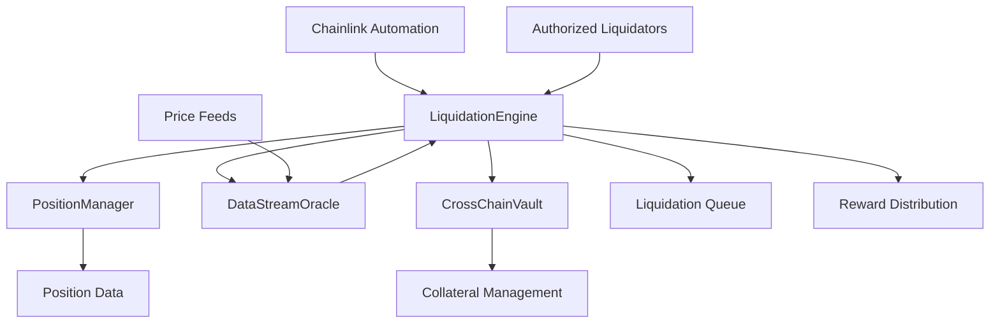

# LiquidationEngine.sol - Complete Documentation

## Overview

The LiquidationEngine is a critical component of the cross-chain perpetual trading platform that manages automated liquidations of underwater positions. It integrates with Chainlink Automation for reliable, decentralized liquidation triggers and ensures the platform maintains proper risk management across multiple blockchains.

## Table of Contents

- [Architecture](#architecture)
- [Core Functionality](#core-functionality)
- [Contract Structure](#contract-structure)
- [Key Components](#key-components)
- [Integration Points](#integration-points)
- [Usage Examples](#usage-examples)
- [Security Features](#security-features)
- [Configuration](#configuration)
- [Deployment Guide](#deployment-guide)

## Architecture



## Core Functionality

### 1. Automated Liquidation System
- **Chainlink Automation Integration**: Uses `checkUpkeep()` and `performUpkeep()` for reliable automated liquidations
- **Health Monitoring**: Continuously monitors position health ratios
- **Batch Processing**: Processes multiple liquidations in a single transaction for gas efficiency

### 2. Risk Management
- **Dynamic Thresholds**: Normal (80%) and emergency (90%) liquidation thresholds
- **PnL Calculations**: Real-time profit/loss calculations using current market prices
- **Price Validation**: Validates price feeds before executing liquidations

### 3. Reward System
- **Liquidator Incentives**: 5% reward for successful liquidations
- **Bounded Rewards**: Minimum $10, maximum $1000 per liquidation
- **Platform Fees**: 1% platform fee on liquidated collateral

## Contract Structure

### State Variables

```solidity
// Core contract interfaces
IPositionManager public positionManager;     // Manages trading positions
IDataStreamOracle public oracle;             // Price feed oracle
ICrossChainVault public vault;               // Cross-chain asset management

// Liquidation parameters
uint256 public constant LIQUIDATION_THRESHOLD = 8000;      // 80% threshold
uint256 public constant LIQUIDATION_REWARD = 500;          // 5% reward
uint256 public constant MIN_LIQUIDATION_REWARD = 10e18;    // $10 minimum
uint256 public constant MAX_LIQUIDATION_REWARD = 1000e18;  // $1000 maximum

// Automation settings
uint256 public lastLiquidationCheck;         // Last automation check timestamp
uint256 public liquidationInterval = 30;    // Check every 30 seconds
uint256 public maxPositionsPerCheck = 50;   // Batch size limit

// Emergency controls
bool public emergencyMode = false;           // Emergency mode flag
uint256 public emergencyLiquidationThreshold = 9000; // 90% emergency threshold
```

### Key Data Structures

```solidity
// Position tracking
mapping(uint256 => bool) public isPositionQueued;    // Queue status tracking
uint256[] public liquidationQueue;                   // Positions awaiting liquidation

// Liquidator management
mapping(address => bool) public authorizedLiquidators;  // Authorized liquidator addresses
mapping(address => uint256) public liquidatorRewards;  // Accumulated rewards
```

## Key Components

### 1. Chainlink Automation Functions

#### `checkUpkeep(bytes calldata)`
**Purpose**: Determines if liquidations need to be performed
**Returns**: `(bool upkeepNeeded, bytes memory performData)`

```solidity
function checkUpkeep(bytes calldata)
    external view override
    returns (bool upkeepNeeded, bytes memory performData)
{
    // Check time condition
    bool timeCondition = (block.timestamp - lastLiquidationCheck) >= liquidationInterval;
    
    if (!timeCondition || paused()) {
        return (false, "");
    }
    
    // Get liquidatable positions
    uint256[] memory positionsToLiquidate = _getPositionsToLiquidate();
    
    if (positionsToLiquidate.length > 0) {
        // Prepare batch data
        upkeepNeeded = true;
        performData = abi.encode(batch);
    }
}
```

**Key Features**:
- Time-based checks (configurable interval)
- Pause state validation
- Batch size optimization
- Gas-efficient position scanning

#### `performUpkeep(bytes calldata performData)`
**Purpose**: Executes liquidations automatically
**Parameters**: `performData` - Encoded array of position IDs to liquidate

```solidity
function performUpkeep(bytes calldata performData) external override {
    require(!paused(), "Contract is paused");
    
    uint256[] memory positionIds = abi.decode(performData, (uint256[]));
    
    for (uint256 i = 0; i < positionIds.length; i++) {
        _executeLiquidation(positionIds[i], address(this));
    }
    
    lastLiquidationCheck = block.timestamp;
}
```

**Key Features**:
- Automatic execution via Chainlink Keepers
- Batch processing for efficiency
- Timestamp tracking for next check

### 2. Manual Liquidation Functions

#### `liquidatePosition(uint256 positionId)`
**Purpose**: Allows authorized liquidators to manually liquidate positions
**Access Control**: Only authorized liquidators
**Security**: ReentrancyGuard, pause check, position validation

```solidity
function liquidatePosition(uint256 positionId) 
    external nonReentrant whenNotPaused 
    onlyAuthorizedLiquidator validPositionId(positionId)
{
    require(_isPositionLiquidatable(positionId), "Position not liquidatable");
    _executeLiquidation(positionId, msg.sender);
}
```

#### `batchLiquidate(uint256[] calldata positionIds)`
**Purpose**: Batch liquidation for multiple positions
**Efficiency**: Processes multiple liquidations in one transaction
**Limits**: Respects `maxPositionsPerCheck` limit

### 3. Core Liquidation Logic

#### `_executeLiquidation(uint256 positionId, address liquidator)`
**Purpose**: Internal function that executes the actual liquidation

**Process Flow**:
1. **Position Validation**: Verify position exists and is active
2. **Price Retrieval**: Get current market price from oracle
3. **PnL Calculation**: Calculate current profit/loss
4. **Reward Calculation**: Determine liquidator reward amount
5. **Position Closure**: Close position through PositionManager
6. **Collateral Liquidation**: Handle collateral through CrossChainVault
7. **Reward Distribution**: Distribute rewards to liquidator
8. **Event Emission**: Emit liquidation event

```solidity
function _executeLiquidation(uint256 positionId, address liquidator) internal {
    // Get position data
    IPositionManager.Position memory position = positionManager.getPosition(positionId);
    require(position.isActive, "Position not active");
    
    // Get current price
    (uint256 currentPrice, bool isValid) = oracle.getPriceWithValidation(feedId);
    require(isValid, "Invalid price data");
    
    // Calculate amounts
    uint256 liquidationReward = _calculateLiquidationReward(position.collateral);
    uint256 platformFee = position.collateral.mul(liquidationFee).div(10000);
    
    // Execute liquidation
    positionManager.closePosition(positionId, currentPrice, liquidator);
    vault.liquidateCollateral(position.trader, position.collateral, liquidator);
    
    // Distribute rewards
    liquidatorRewards[liquidator] = liquidatorRewards[liquidator].add(liquidationReward);
    
    emit PositionLiquidated(positionId, position.trader, liquidator, 
                          position.collateral, liquidationReward, block.timestamp);
}
```

### 4. Health Ratio Calculations

#### `_calculateHealthRatio(Position memory position, int256 pnl)`
**Purpose**: Calculates position health ratio for liquidation decisions
**Formula**: `(collateral + pnl) / position_size * 10000`

```solidity
function _calculateHealthRatio(IPositionManager.Position memory position, int256 pnl) 
    internal pure returns (uint256) 
{
    int256 adjustedCollateral = int256(position.collateral).add(pnl);
    
    if (adjustedCollateral <= 0) return 0;
    
    return uint256(adjustedCollateral).mul(10000).div(position.size);
}
```

**Health Ratio Interpretation**:
- **Above 8000 (80%)**: Healthy position
- **Below 8000 (80%)**: Liquidatable in normal mode
- **Below 9000 (90%)**: Liquidatable in emergency mode
- **0**: Position has no remaining collateral value

#### `_calculatePnL(Position memory position, uint256 currentPrice)`
**Purpose**: Calculates unrealized profit/loss for a position

```solidity
function _calculatePnL(IPositionManager.Position memory position, uint256 currentPrice) 
    internal pure returns (int256) 
{
    if (position.isLong) {
        // Long position: profit when price increases
        return int256(currentPrice.sub(position.entryPrice).mul(position.size).div(position.entryPrice));
    } else {
        // Short position: profit when price decreases
        return int256(position.entryPrice.sub(currentPrice).mul(position.size).div(position.entryPrice));
    }
}
```

### 5. Queue Management System

#### `queuePositionForLiquidation(uint256 positionId)`
**Purpose**: Adds positions to liquidation queue for monitoring
**Use Case**: Positions approaching liquidation threshold

```solidity
function queuePositionForLiquidation(uint256 positionId) external onlyAuthorizedLiquidator {
    require(!isPositionQueued[positionId], "Position already queued");
    
    liquidationQueue.push(positionId);
    isPositionQueued[positionId] = true;
    
    // Calculate and emit health ratio
    uint256 healthRatio = _calculateHealthRatio(position, pnl);
    emit LiquidationQueued(positionId, healthRatio);
}
```

#### `_removeFromQueue(uint256 positionId)`
**Purpose**: Removes positions from queue after liquidation or recovery

### 6. Reward System

#### `_calculateLiquidationReward(uint256 collateral)`
**Purpose**: Calculates liquidator reward with bounds

```solidity
function _calculateLiquidationReward(uint256 collateral) internal pure returns (uint256) {
    uint256 reward = collateral.mul(LIQUIDATION_REWARD).div(10000); // 5%
    
    // Apply bounds
    if (reward < MIN_LIQUIDATION_REWARD) {
        reward = MIN_LIQUIDATION_REWARD;      // Minimum $10
    } else if (reward > MAX_LIQUIDATION_REWARD) {
        reward = MAX_LIQUIDATION_REWARD;      // Maximum $1000
    }
    
    return reward;
}
```

**Reward Structure**:
- **Base Rate**: 5% of liquidated collateral
- **Minimum**: $10 USD equivalent
- **Maximum**: $1000 USD equivalent
- **Purpose**: Incentivize liquidator participation while controlling costs

## Integration Points

### 1. IPositionManager Interface
**Purpose**: Manages trading positions and position data
**Key Functions**:
- `getPosition(uint256 positionId)`: Retrieve position details
- `closePosition(uint256 positionId, uint256 price, address liquidator)`: Close position
- `getAllActivePositions()`: Get all active position IDs
- `updatePositionPnl(uint256 positionId, int256 pnl)`: Update position PnL

### 2. IDataStreamOracle Interface
**Purpose**: Provides real-time price feeds
**Key Functions**:
- `getLatestPrice(bytes32 feedId)`: Get latest price and timestamp
- `getPriceWithValidation(bytes32 feedId)`: Get price with validation flag

### 3. ICrossChainVault Interface
**Purpose**: Manages cross-chain collateral
**Key Functions**:
- `getCollateralValue(address user, address token)`: Get collateral value
- `liquidateCollateral(address user, uint256 amount, address liquidator)`: Execute liquidation
- `getTotalCollateralUSD(address user)`: Get total collateral in USD

## Security Features

### 1. Access Control
- **Ownable**: Owner-only admin functions
- **Authorized Liquidators**: Whitelist of liquidator addresses
- **Role-based Permissions**: Different permission levels for different functions

### 2. Reentrancy Protection
- **ReentrancyGuard**: Prevents reentrancy attacks on critical functions
- **State Updates**: Proper state updates before external calls

### 3. Pause Mechanism
- **Pausable**: Emergency pause functionality
- **Emergency Mode**: Special mode with different thresholds
- **Circuit Breakers**: Automatic stopping mechanisms

### 4. Input Validation
- **Position ID Validation**: Ensures valid position IDs
- **Price Validation**: Validates oracle price data
- **Threshold Checks**: Validates configuration parameters

## Configuration

### 1. Liquidation Parameters
```solidity
// Adjustable parameters
uint256 public liquidationInterval = 30;        // Automation check interval
uint256 public maxPositionsPerCheck = 50;       // Batch processing limit
uint256 public liquidationFee = 100;            // Platform fee (1%)
bool public emergencyMode = false;              // Emergency mode toggle
```

### 2. Admin Functions
```solidity
function setLiquidationInterval(uint256 _interval) external onlyOwner;
function setMaxPositionsPerCheck(uint256 _maxPositions) external onlyOwner;
function setLiquidationFee(uint256 _fee) external onlyOwner;
function toggleEmergencyMode() external onlyOwner;
function authorizeLiquidator(address liquidator) external onlyOwner;
function revokeLiquidator(address liquidator) external onlyOwner;
```

## Usage Examples

### 1. Deploying the Contract
```solidity
// Deploy with required contract addresses
LiquidationEngine liquidationEngine = new LiquidationEngine(
    positionManagerAddress,
    oracleAddress,
    vaultAddress,
    feeRecipientAddress
);

// Authorize liquidators
liquidationEngine.authorizeLiquidator(liquidatorBotAddress);
liquidationEngine.authorizeLiquidator(manualLiquidatorAddress);
```

### 2. Setting Up Chainlink Automation
```javascript
// Register upkeep with Chainlink Automation
const upkeepContract = liquidationEngine.address;
const gasLimit = 2000000;
const checkData = "0x"; // Empty check data

// Register through Chainlink Automation UI or programmatically
```

### 3. Manual Liquidation
```solidity
// Check if position is liquidatable
bool isLiquidatable = liquidationEngine._isPositionLiquidatable(positionId);

if (isLiquidatable) {
    // Execute liquidation
    liquidationEngine.liquidatePosition(positionId);
}
```

### 4. Monitoring Position Health
```solidity
// Get position health ratio
uint256 healthRatio = liquidationEngine.getPositionHealthRatio(positionId);

if (healthRatio < 8500) { // Below 85%
    // Queue for close monitoring
    liquidationEngine.queuePositionForLiquidation(positionId);
}
```

## Events

### 1. Liquidation Events
```solidity
event PositionLiquidated(
    uint256 indexed positionId,
    address indexed trader,
    address indexed liquidator,
    uint256 collateralLiquidated,
    uint256 liquidatorReward,
    uint256 timestamp
);
```

### 2. Queue Management Events
```solidity
event LiquidationQueued(uint256 indexed positionId, uint256 healthRatio);
event LiquidationDequeued(uint256 indexed positionId);
```

### 3. Admin Events
```solidity
event EmergencyModeToggled(bool enabled);
event LiquidatorAuthorized(address indexed liquidator);
event LiquidatorRevoked(address indexed liquidator);
```

## Error Handling

### 1. Common Errors
- `"Position not liquidatable"`: Position health ratio above threshold
- `"Invalid price data"`: Oracle price validation failed
- `"Position not active"`: Attempting to liquidate closed position
- `"Not authorized liquidator"`: Unauthorized liquidation attempt

### 2. Safety Checks
- Price feed validation before liquidation
- Position existence verification
- Collateral sufficiency checks
- Reentrancy protection

## Gas Optimization

### 1. Batch Processing
- Process multiple liquidations in single transaction
- Configurable batch size limits
- Efficient array operations

### 2. Storage Optimization
- Packed structs for gas efficiency
- Minimal storage reads/writes
- Efficient queue management

### 3. Computation Optimization
- Cached calculations
- Optimized mathematical operations
- Early returns for invalid conditions

## Testing Strategy

### 1. Unit Tests
```javascript
describe("LiquidationEngine", function() {
    it("Should liquidate underwater positions", async function() {
        // Test liquidation logic
    });
    
    it("Should respect liquidation thresholds", async function() {
        // Test threshold calculations
    });
    
    it("Should distribute rewards correctly", async function() {
        // Test reward calculations
    });
});
```

### 2. Integration Tests
- Test with real Chainlink feeds
- Cross-chain liquidation scenarios
- Emergency mode testing
- Automation integration testing

### 3. Stress Tests
- High-frequency liquidation scenarios
- Large batch processing
- Network congestion handling
- Oracle failure scenarios

## Deployment Guide

### 1. Prerequisites
- Deployed PositionManager contract
- Deployed DataStreamOracle contract
- Deployed CrossChainVault contract
- Chainlink Automation subscription

### 2. Deployment Steps
```bash
# 1. Deploy contract
npx hardhat run scripts/deploy-liquidation-engine.js --network mainnet

# 2. Verify contract
npx hardhat verify --network mainnet DEPLOYED_ADDRESS

# 3. Configure parameters
npx hardhat run scripts/configure-liquidation-engine.js --network mainnet

# 4. Register with Chainlink Automation
# (Use Chainlink Automation UI)
```

### 3. Post-Deployment Configuration
1. Authorize liquidator addresses
2. Set appropriate liquidation parameters
3. Register with Chainlink Automation
4. Fund automation subscription
5. Test liquidation functionality

## Monitoring and Maintenance

### 1. Key Metrics to Monitor
- Number of liquidations per day
- Average liquidation time
- Liquidator reward distribution
- Position health ratios
- Automation upkeep performance

### 2. Maintenance Tasks
- Monitor automation balance
- Update liquidation parameters as needed
- Review liquidator performance
- Update oracle feeds if necessary
- Emergency response procedures

### 3. Alerts and Notifications
- Low automation balance
- Failed liquidations
- Oracle feed issues
- Unusual liquidation patterns
- Emergency mode activation

## Conclusion

The LiquidationEngine provides a comprehensive, secure, and efficient liquidation system for the cross-chain perpetual trading platform. Its integration with Chainlink Automation ensures reliable, decentralized liquidation triggers while maintaining proper risk management across multiple blockchains.

The contract is designed with security, efficiency, and maintainability in mind, providing both automated and manual liquidation capabilities with proper incentive structures for liquidators.